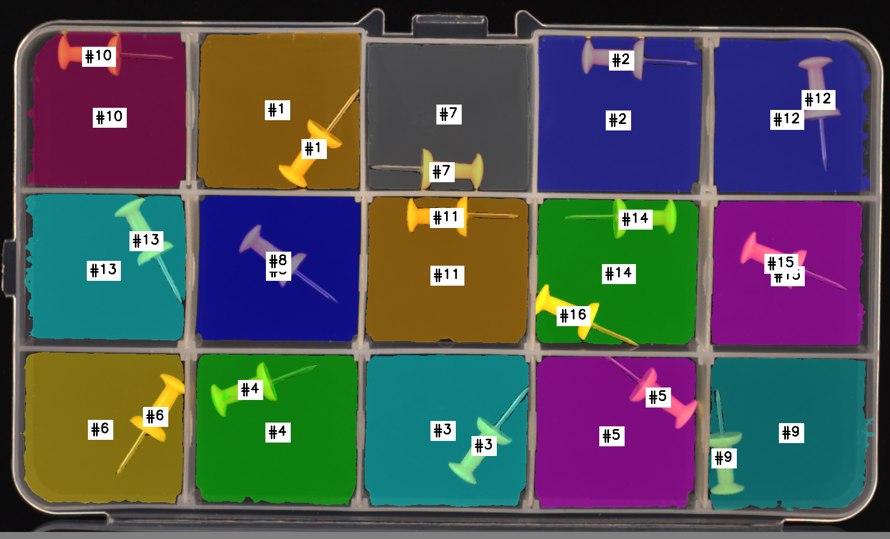

# CASCADE

**Constraint-Aware Scaffolded Decomposition for Logical Anomaly Detection**

[Project page](https://edjjincode.github.io/CASCADE/) · [Paper](https://edjjincode.github.io/CASCADE/assets/cascade_icdm2026.pdf) · IEEE ICDM 2026

A logical anomaly is not a defect in the pixels. Every object in the
picture can be flawless and the product still wrong — two tangerines
where there should be one, a cable in the wrong slot, juice filled to the
brim. What is broken is a *rule*, and the rule is not visible in any
single region of the image.

Vision-language models can read such rules. What they cannot reliably do
is hold the evidence for one while they answer: they conflate instances
that look alike, and they estimate continuous quantities by eye. CASCADE
takes that bookkeeping out of the model and puts it into the picture.



Each rule gets a **scaffold** — the image redrawn so the rule can be read
off it — and a question phrased so that the answer is about the image and
not about the phrasing:

| the rule is about | the model's difficulty | the scaffold |
|---|---|---|
| **composition** — what is present, and what corresponds to what | telling apart instances that look identical | every instance gets a colour and a number; matched instances share both |
| **calibration** — a position, a level, a length | judging a continuous quantity by eye | a grid fitted on normal references, every intersection labelled `(row, col)` |

Which scaffold a rule gets is decided from the rule's own wording. No
part of the code names a product category.

---

## Quick start

```bash
git clone https://github.com/edjjincode/CASCADE && cd CASCADE
pip install -r requirements.txt
```

Two commands work immediately — no API key, no dataset, no GPU. They
read what is already in the repository:

```bash
python run.py constraints          # the 19 rules, and how each is classified
python run.py show PP-L1           # one rule: its decomposition, and the exact question asked
python -m pytest tests -q          # 21 tests, no key and no dataset
```

`show` is the fastest way to see what the system actually does. It prints
the rule, what the grounding stages made of it, the matching program that
was compiled from that, and then the complete prompt — the same text the
model receives, nothing summarised.

To run inference, add the images and a key:

```bash
python scripts/download_mvtec_loco.py      # → ./data
cp .env.example .env && $EDITOR .env       # OPENROUTER_API_KEY=...
export $(grep -v '^#' .env | xargs)

python run.py check PP-L1 data/pushpins/test/logical_anomalies/000.png
```

```
scaffold  out/PP-L1_000.png
answer    No
verdict   VIOLATED
```

The model answered a question that asked whether the rule *holds*. "No"
is the anomaly; the inversion happens in code, so the model is never told
which reply counts as the alarm.

---

## Running a whole category

Calibrate once, then check images against it:

```bash
python run.py calibrate juice_bottle             # 3 model calls per rule, once
python run.py test juice_bottle data/juice_bottle/test/logical_anomalies
python run.py evaluate out/juice_bottle_results.json
```

Calibration grounds each rule and, for a rule about a range, measures the
normal interval from three normal images — in code, with no model
involved. Everything it produces is written to `examples/calibration.json`
and reused for every query image afterwards, so verification costs one
model call per rule per image and nothing more.

The groundings for all 19 rules ship in that file already, so the only
part of calibration you may want to redo is the measurement:

```bash
python run.py fit juice_bottle                    # re-measure; no API key
python run.py fit juice_bottle a.png b.png c.png  # against your own references
```

`evaluate` needs no key — it reads the results file. It labels each image
from where it sits on disk (`.../logical_anomalies/...` is anomalous) and
reports precision, recall, F1, balanced accuracy and AUROC. An image is
called anomalous when *any* of its rules is violated, so the AUROC score
is the number of rules violated; `cascade/evaluate.py` says what that
does and does not make it comparable to. Pass `--truth` to also score each
rule on its own.

Results will not match the paper's to the decimal. The backends are
stochastic and providers change them; the point of this repository is
that the pipeline is legible and reproducible in structure, not that a
number comes back identical.

---

## How it works

```
constraints/atomic_units.json      a rule, in plain language
        │
        ├── parse.py         three grounding stages, once per rule
        │      Comprehend    what kind of rule is this?        text only
        │      Locate        which objects does it name?       1 reference image
        │      Compare       which edges may vary?             K reference images
        │
        ├── detect.py        instance masks for those objects  (shipped, precomputed)
        ├── calibrate.py     the normal range, from K refs     no model
        │
        ├── scaffold/        the image, redrawn                no model
        │      plan.py       strategy → matching program
        │      engine.py     eight geometric primitives
        │      disambiguate.py · align.py
        │
        ├── question.py      the rule, stated affirmatively
        └── pipeline.py      one model call → a verdict
```

### The model picks the strategy; the code writes the program

Grounding asks the model to *classify*, never to compose. Every field it
returns comes from a closed vocabulary, and the parser rejects anything
else:

```
taxonomy_class       range-based | composition-based
binding_type         property | relational | (none)
matching_criterion   none | spatial_rank | 2d_grid | mirror | nn_match
color_scheme         unique_per_type | shared_per_match | gradient_by_rank | per_instance
id_scheme            instance_index | match_index | natural_position | role_position
primary_axis         horizontal | vertical | none
edge                 top | bottom | left | right | major | minor | length | diameter
```

One of those words — `matching_criterion` — is compiled by
`scaffold/plan.py` into a program over five primitives (`sort`,
`sort_lex`, `zip_align`, `reflect`, `nn_match`), which
`scaffold/engine.py` executes as pure geometry. Five and not more: the
set is exactly what the criteria compile to, so every primitive in the
engine is one some rule can actually reach.
So `mirror` always becomes the same two steps:

```python
>>> build_matching_program("mirror", [["left_connector", "right_connector"]], "horizontal")
[reflect(target=right_connector, axis=y), nn_match(a=left_connector, b=right_connector)]
```

The same rule therefore yields the same scaffold structure on every run,
however the model happens to be feeling. It also means no product
category can leak into the code, because there is nowhere for one to go.

### Calibration, and the two constants

A rule about a range needs a grid coarse enough that ordinary
manufacturing variation stays inside one cell, and fine enough that a
real deviation leaves it. `calibrate.py` fits the finest grid for which
every reference edge lands in a single cell with margin.

Two constants bound that fit — `m`, the margin within which a mark
cannot be reliably assigned to a side, and `w_min`, the spacing below
which cell labels stop being readable. Both are properties of the
*backend*, not of any product, and are measured once on synthetic probes:

```bash
python calibration/probe_margin.py --report      # m     = 25 px
python calibration/probe_spacing.py --report     # w_min = 60 px
```

The saved responses are in the repository, so both reports reproduce
without any API calls.

### Masks are an input, not a contribution

CASCADE's claim is about scaffolding. Given instance masks for the
objects a rule names, it draws the image so the rule is legible; where
those masks came from is a separate question. So segmentation is an
interface with one method:

```python
class MaskSource(Protocol):
    def masks(self, image, phrases) -> dict[str, list[Instance]]: ...
```

The default reads a **precomputed mask pack** shipped with the repository
— run-length-encoded, one gzipped file per category, no GPU and no
segmentation model needed. That is why the whole pipeline runs from a
plain `pip install`. To segment with something else, implement the
protocol and pass it to `Pipeline(masks=...)`.

---

## What is in here

| | |
|---|---|
| `constraints/` | the 19 rules, and how they were derived from LogicQA |
| `prompts/` | every prompt, verbatim, as plain text |
| `cascade/` | the pipeline |
| `calibration/` | the two probes that fix `m` and `w_min`, with their data |
| `examples/` | a worked case, with its calibration cached |
| `masks/` | precomputed instance masks |
| `tests/` | what is checked without a key, a GPU or the dataset |

`tests/` is the other short read. Almost everything after the model's
one classification is deterministic, so almost all of it can be pinned
down: that a strategy compiles to the program it names, that `mirror`
pairs across the axis, that a surplus object survives to be drawn, and
that the cell number the question quotes is the one `align.py` prints on
the image.

`prompts/` is worth opening on its own. It is five files — three
grounding stages and two question templates — each with a header saying
what goes in, what comes out, which paper section it belongs to, and
which function sends it. Nothing about what the model is asked is hidden
in a format string.

---

## Citation

```bibtex
@inproceedings{cascade2026,
  title     = {CASCADE: Constraint-Aware Scaffolded Decomposition for
               Logical Anomaly Detection},
  booktitle = {ICDM},
  year      = {2026}
}
```

## Licence

The code is MIT. The shipped mask packs and the example scaffold are
derived from MVTec LOCO AD and carry that dataset's CC BY-NC-SA 4.0 —
attribution, non-commercial, share-alike — so they are not MIT and cannot
be relicensed. The dataset images are not redistributed; the constraint
wording is quoted from LogicQA with citation. `LICENSE` says which file
falls under which.
